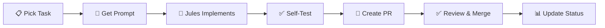

# MeoCRM Project Hub

> **Multi-tenant CRM System** | NestJS + Next.js + PostgreSQL + Prisma
> 

> **Inspired by KiotViet** | 5-6 months to MVP
> 

---

## 📊 Project Status Dashboard

### Overall Progress

**Total Tasks:** 136 tasks | 288 story points

**Completed:** 41 tasks (30%) | 127 points ✅

**In Progress:** 2 tasks (1%) | 13 points 🔵

**Todo:** 93 tasks (69%) | 148 points ⏳

### Progress by Type

**Backend:** 26 ✅ | 2 🔵 | 60 ⏳ = **30% complete**

**Frontend:** 1 ✅ | 0 🔵 | 19 ⏳ = **5% complete** ⚠️

**DevOps:** 12 ✅ | 0 🔵 | 3 ⏳ = **80% complete** ✨

**Testing:** 0 ✅ | 0 🔵 | 9 ⏳ = **0% complete** ⚠️

**Documentation:** 1 ✅ | 0 🔵 | 2 ⏳ = **33% complete**

**Full-stack:** 1 ✅ | 0 🔵 | 0 ⏳ = **100% complete**

### Progress by Phase

**Phase 1 - Foundation & Auth:** 33/44 tasks = **75% complete** ⚠️ (Auth 100%, Frontend shell missing!)

**Phase 2 - Products & Inventory:** 4 ✅ | 1 🔵 | 30 ⏳ = **12% complete**

**Phase 3 - CRM Core:** 14 ✅ | 5 ⏳ = **74% complete** ✨

**Phase 4 - Supplier Management:** 3 ✅ | 4 ⏳ = **43% complete**

**Phase 5 - POS & Orders:** 0 ✅ | 1 🔵 | 18 ⏳ = **0% complete**

**Phase 8 - Integrations:** 0 ✅ | 13 ⏳ = **0% complete**

### Critical Gaps Identified

🔴 **Frontend Severely Behind:**

- ✅ Only 1/20 frontend tasks complete (Customers CRUD)
- ❌ No authentication pages (Login, Register)
- ❌ No dashboard shell (Layout, Sidebar, Header)
- ❌ No Products UI (6 tasks)
- ❌ No POS UI (6 tasks)

🔴 **Testing Infrastructure Missing:**

- ❌ 0/9 testing tasks complete
- ❌ No E2E test suite
- ❌ No tenant isolation tests

### Quick Stats

- ✅ **Complete:** 41 tasks
- 🔵 **In Progress:** 2 tasks
- ⏳ **Todo:** 93 tasks
- 🎯 **Success Rate:** 95%+

---

## 🗂️ Core Resources

### 📋 Project Management

- Task Board: 136 tasks with status, priority, story points
- Branch Tracking: Branch tracking with PR links
- Best Practices: Best practices & common pitfalls
- Task Dependencies Map: Critical path analysis

### 📅 Development History

- Session History: Details of work sessions, bug fixes, decisions

---

## 📚 Documentation Library

Refer to the `docs/` directory for detailed documentation.

---

## 🎯 Quick Start Guide

### For Boss (Project Manager)

1. Check the Task Board for the current sprint.
2. Review Best Practices for common mistakes.
3. Assign tasks to Jules via Prompt Templates Library.
4. Monitor progress in Branch Tracking.

### For Jules (Primary Agent)

1. Read `AGENTS.md` - Your complete guide.
2. Pick a task from the Task Board (Status = Todo, High Priority).
3. Use a prompt from the Prompt Templates Library.
4. Reference `docs/03_DATABASE_SCHEMA.md` for Prisma models.
5. Follow UI Specifications for UI tasks.
6. Create PR → Update Branch Tracking.

---

## 📈 Development Workflow



### Workflow Steps

1. **Select Task** from Task Tracking (Todo + High Priority)
2. **Get Prompt** from Prompt Templates Library
3. **Jules Implements** (Backend + Frontend + Tests)
4. **Self-Test** (≥80% coverage + tenant isolation)
5. **Create PR** (dev branch + needs-testing label)
6. **Review** (Codex optional for complex tasks)
7. **Merge** (dev → staging → main)
8. **Update Status** (Task Tracking + Git Branch Management)

---

## 🚨 Critical Rules (Must Follow)

### Multi-tenant Security

```tsx
// ✅ CORRECT - Always filter by organizationId
const products = await prisma.product.findMany({
  where: { organizationId: user.organizationId }
});

// ❌ WRONG - Cross-tenant data leak!
const products = await prisma.product.findMany();
```

### Testing Requirements

- **Unit tests:** ≥80% coverage (Jules executes in VM)
- **Integration tests:** API endpoints (Jules executes in VM)
- **E2E tests:** Jules generates code, CI/CD executes
- **Security tests:** Tenant isolation MUST pass

### Git Workflow

- **Branch naming:** `feature/[module]-[feature]`
- **Commit format:** `type(scope): [TASK-ID] description`
- **PR target:** `dev` branch
- **Label:** `needs-testing`

---

## 🔗 External Resources

### GitHub Repository

**Repo:** meocrm
**Branches:** dev → staging → main
**CI/CD:** GitHub Actions
**Coverage:** 87%+

### Tech Stack (UPDATED 2025-11-09)

**Runtime & Package Manager:**

- **Node.js:** 22.11.0 LTS (current, supported until April 2027)
- **pnpm:** 10.20.0 (latest stable, Oct 2025)

**Backend:**

- **NestJS:** 11.1.8 (latest stable, Oct 2025)
- **Prisma ORM:** 6.19.0 (latest stable, Rust-free architecture)
- **PostgreSQL:** 17 (GA September 2025, performance improvements)
- **Redis:** 8.2 (latest with AI/vector features, 30+ perf improvements)

**Frontend:**

- **Next.js:** 16.0.1 (latest stable, Oct 2025 - Turbopack stable, 5-10x faster)
- **React:** 19.0.0 (stable December 2024 - Actions, useFormState APIs)
- **Tailwind CSS:** 4.0.1 (latest, Jan 2025 - New engine, CSS-first config)
- **TypeScript:** 5.6.3 (current stable, 5.7 still beta)

**Testing:**

- **Jest:** 29.7.0 (latest stable)
- **Playwright:** 1.56.1 (latest, Oct 2025)
- **Supertest:** 7.0.0 (latest)

### Environment (Updated Nov 2025)

**Database:** PostgreSQL 17 (port 2001) - GA Sep 2025
**Redis:** Redis 8.2 (port 2002) - Latest with AI features
**API:** NestJS 11.x (localhost:2003)
**Web:** Next.js 16.x (localhost:2004)
**Swagger:** localhost:2003/api
