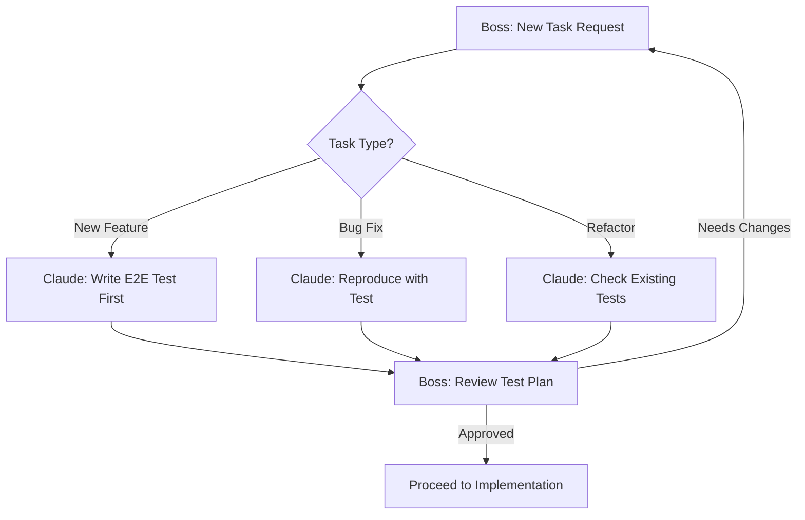
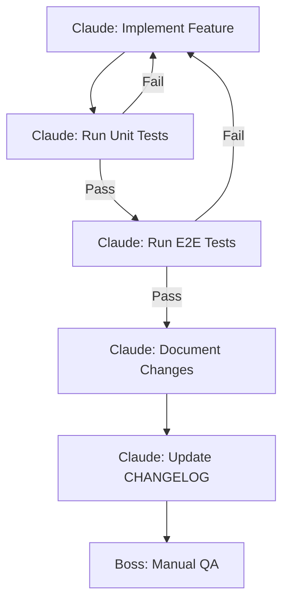
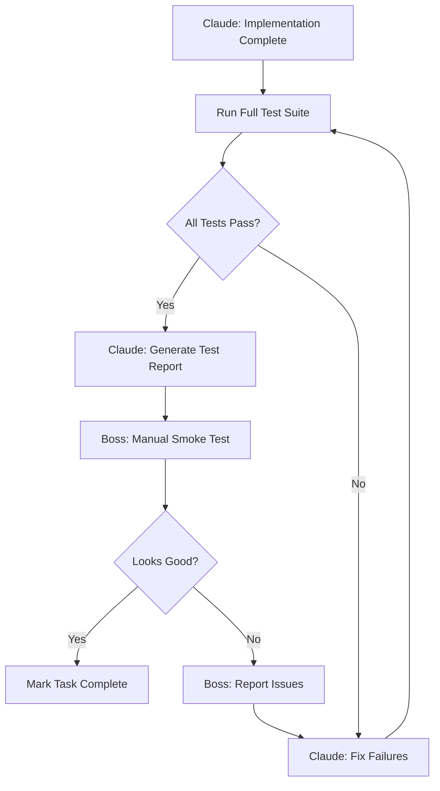
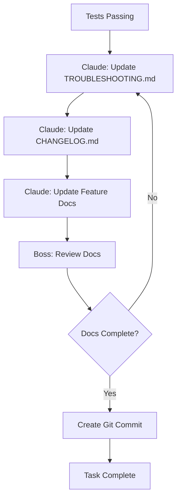

# 🔄 Optimal Workflow: Boss ↔ Claude AI Agent

> **Purpose:** Define optimal collaboration workflow between Boss (Shine) and Claude AI Agent
>
> **Last Updated:** November 16, 2025
>
> **Maintainer:** Claude + Boss

---

## 📋 Table of Contents

1. [Current Workflow Problems](#current-workflow-problems)
2. [Proposed Optimal Workflow](#proposed-optimal-workflow)
3. [Communication Protocol](#communication-protocol)
4. [Testing Strategy](#testing-strategy)
5. [Session Management](#session-management)
6. [Documentation Standards](#documentation-standards)

---

## ⚠️ Current Workflow Problems

### Issues Identified from Recent Sessions

1. **Session Context Loss**
   - Previous session fixes get lost/reverted in new sessions
   - Example: Login 404 bug fixed in session 1, reappeared in session 2
   - Root cause: Browser cache + shell snapshot persistence

2. **Manual Testing Burden**
   - Boss has to manually test every change
   - No automated verification after fixes
   - Time-consuming and error-prone

3. **Incomplete Documentation**
   - Troubleshooting docs don't capture all edge cases
   - Missing runbook for common operations
   - New sessions repeat same investigations

4. **Test-First Development Missing**
   - Tests written after code, causing mismatches
   - Example: Dual login buttons vs test expectations
   - Hard to maintain test coverage

5. **No Continuous Verification**
   - Changes not verified against E2E tests before completion
   - Regressions only discovered later
   - No automated regression detection

---

## ✅ Proposed Optimal Workflow

### Phase 1: Task Initiation



#### Boss Responsibilities:
1. **Clear Task Definition**
   ```markdown
   # Good task request:
   Implement feature X that does Y
   - Acceptance criteria: [list]
   - Expected behavior: [description]
   - Test scenarios: [list]

   # Bad task request:
   Fix the login bug
   ```

2. **Provide Context**
   - Link to relevant docs/files
   - Share error messages/screenshots
   - Mention if this is continuation of previous session

#### Claude Responsibilities:
1. **Understand Requirements**
   - Ask clarifying questions
   - Propose test scenarios
   - Confirm acceptance criteria

2. **Create Test Plan**
   - Write E2E test outline
   - Get Boss approval before coding
   - Update tests if requirements change

### Phase 2: Implementation



#### Claude Implementation Checklist:

```bash
# Before starting implementation:
[ ] Read existing code/docs
[ ] Create TodoWrite task list
[ ] Write/update E2E tests first

# During implementation:
[ ] Follow existing code patterns
[ ] Add inline comments for complex logic
[ ] Use TypeScript strict mode
[ ] Handle error cases

# After implementation:
[ ] Run unit tests: pnpm test
[ ] Run E2E tests: npx playwright test
[ ] Check for TypeScript errors: pnpm tsc --noEmit
[ ] Update relevant docs
[ ] Clear caches if needed
```

#### Boss Responsibilities:
1. **Provide Quick Feedback**
   - Review test results
   - Test manually if needed
   - Approve or request changes

2. **Avoid Mid-Task Changes**
   - Don't change requirements mid-implementation
   - If needed, finish current task first

### Phase 3: Testing & Verification



#### Automated Testing Strategy:

**1. Unit Tests (Fast, Isolated)**
```bash
# Run before committing
pnpm --filter @meocrm/api test
pnpm --filter @meocrm/web test
```

**2. E2E Tests (Comprehensive, Slower)**
```bash
# Run for critical paths
npx playwright test tests/e2e/auth.spec.ts --workers=2

# Run full suite before major releases
npx playwright test --workers=2
```

**3. Visual Regression Tests (Future)**
```bash
# Planned: Screenshot comparison
npx playwright test --update-snapshots
```

#### Manual Testing Checklist:

Boss should test these scenarios after significant changes:

```markdown
# Authentication Flow
- [ ] Login with valid credentials
- [ ] Login with invalid credentials
- [ ] Logout
- [ ] Session persistence after refresh

# Critical Business Flows
- [ ] Create customer
- [ ] Create product
- [ ] Create order
- [ ] View reports

# Cross-browser Testing (if UI changes)
- [ ] Chrome
- [ ] Firefox
- [ ] Safari (if Mac available)
```

### Phase 4: Documentation & Closure



#### Documentation Requirements:

**1. Update TROUBLESHOOTING.md**
- Add new issues encountered
- Document solutions
- Include code snippets

**2. Update CHANGELOG.md**
```markdown
# Format:
## [Date] - Feature/Fix Name

### Added
- New feature X with Y functionality

### Fixed
- Bug Z causing issue W

### Changed
- Updated component A to use pattern B
```

**3. Update Feature Docs**
- API documentation
- Component usage examples
- Configuration guides

---

## 🗣️ Communication Protocol

### Boss → Claude Commands

#### Priority Levels:
```bash
# P0 - Critical (Production down)
"[P0] Production login broken, users can't access system"

# P1 - High (Major feature broken)
"[P1] Customer creation failing with 500 error"

# P2 - Medium (Minor bug or feature request)
"[P2] Add pagination to customer list"

# P3 - Low (Enhancement, refactor)
"[P3] Refactor auth service for better readability"
```

#### Command Patterns:

**1. New Feature Request**
```
Implement [feature name] that allows users to [action]

Requirements:
- [requirement 1]
- [requirement 2]

Acceptance Criteria:
- [ ] [criterion 1]
- [ ] [criterion 2]

Test Scenarios:
- [scenario 1]
- [scenario 2]
```

**2. Bug Fix Request**
```
Fix [issue] in [component/feature]

Current Behavior:
- [what's happening now]

Expected Behavior:
- [what should happen]

Steps to Reproduce:
1. [step 1]
2. [step 2]
3. [observe issue]

Error Messages/Screenshots:
- [attach here]
```

**3. Investigation Request**
```
Investigate why [behavior/metric] is happening

Context:
- [background information]

Questions:
- [question 1]
- [question 2]

Don't implement fixes yet, just report findings.
```

**4. Quick Approval/Rejection**
```
# Approval
"ok" or "looks good" or "proceed"

# Request changes
"change X to Y" or "try approach Z instead"

# Need more info
"show me the code for [component]"
```

### Claude → Boss Updates

#### Status Update Format:

```markdown
## Task: [Task Name]

### Current Status: [In Progress/Blocked/Complete]

### Completed:
- [x] Item 1
- [x] Item 2

### In Progress:
- [ ] Item 3 (50% done)

### Next Steps:
- [ ] Item 4
- [ ] Item 5

### Issues/Questions:
- [issue 1]
- [question 1]

### Test Results:
- Unit tests: ✅ 45/45 passing
- E2E tests: ⚠️ 9/12 passing (3 expected failures)
```

#### Ask for Guidance When:

1. **Multiple Valid Approaches**
   ```
   I see two ways to implement this:

   Option A: [description]
   Pros: [list]
   Cons: [list]

   Option B: [description]
   Pros: [list]
   Cons: [list]

   Which approach do you prefer?
   ```

2. **Unclear Requirements**
   ```
   Need clarification on [requirement]:

   Question: [specific question]

   This affects: [what it impacts]
   ```

3. **Breaking Changes Required**
   ```
   Warning: This change will break [existing functionality]

   Impact: [description]
   Migration needed: [yes/no]

   Should I proceed?
   ```

---

## 🧪 Testing Strategy

### Test Pyramid

```
        /\
       /  \
      / E2E \          ← Slow, Comprehensive (10%)
     /______\
    /        \
   /  Integ   \        ← Medium Speed (20%)
  /____________\
 /              \
/  Unit Tests    \     ← Fast, Focused (70%)
/__________________\
```

### When to Write Tests

#### Always Write Tests For:
- ✅ New features
- ✅ Bug fixes (regression prevention)
- ✅ Critical business logic
- ✅ Authentication/authorization
- ✅ Data validation

#### Optional Tests For:
- ⚠️ UI styling changes (visual regression instead)
- ⚠️ Configuration changes
- ⚠️ Documentation updates

### Test-Driven Development (TDD) Flow

```bash
# 1. Write failing test
npx playwright test tests/e2e/new-feature.spec.ts
# ❌ Expected button to be visible, but it wasn't

# 2. Implement minimum code to pass
# [write implementation]

# 3. Run test again
npx playwright test tests/e2e/new-feature.spec.ts
# ✅ 1 passed

# 4. Refactor if needed
# [improve code quality]

# 5. Verify test still passes
npx playwright test tests/e2e/new-feature.spec.ts
# ✅ 1 passed
```

### Test Maintenance

**Weekly:**
- Review failing tests
- Update selectors if UI changed
- Remove obsolete tests

**Monthly:**
- Review test coverage
- Add tests for uncovered critical paths
- Refactor slow tests

---

## 📦 Session Management

### Starting a New Session

#### Boss Checklist:
```markdown
# Before starting:
- [ ] Review previous session summary
- [ ] Check if servers are running
- [ ] Note any manual changes made since last session
- [ ] Prepare task requirements

# First message to Claude:
This is a [new task / continuation of previous session]

[If continuation]:
Previous session context: [brief summary]
Current state: [what's working/not working]

[Task description]
```

#### Claude Checklist:
```bash
# Session initialization:
1. Check current directory: pwd
2. Verify git status: git status
3. Check running processes: ps aux | grep -E "(node|next|nest)"
4. Read recent docs if continuation
5. Create TodoWrite task list
6. Confirm understanding with Boss
```

### Ending a Session

#### Claude Final Report Template:

```markdown
## Session Summary: [Date]

### Tasks Completed:
1. [Task 1] - ✅ Complete
   - Files changed: [list]
   - Tests: [status]

2. [Task 2] - ⚠️ Partial
   - What's done: [description]
   - What's remaining: [description]

### Changes Made:
- Modified files:
  - [file 1]: [description of change]
  - [file 2]: [description of change]
- New files:
  - [file 1]: [purpose]

### Test Results:
- Unit tests: [X passing / Y total]
- E2E tests: [X passing / Y total]
- Manual testing needed: [yes/no]

### Known Issues:
- [Issue 1]: [description and workaround]
- [Issue 2]: [description and workaround]

### Next Session Recommendations:
1. [Recommendation 1]
2. [Recommendation 2]

### Important Notes:
- [Note 1]
- [Note 2]
```

### Context Preservation

**What Gets Saved:**
- ✅ Code changes (in git)
- ✅ Documentation updates
- ✅ Test files
- ✅ Configuration changes

**What Gets Lost:**
- ❌ Running processes (must restart)
- ❌ Environment variables (must reset)
- ❌ Conversation context
- ❌ In-memory cache

**How to Preserve Context:**
1. **Commit often** with descriptive messages
2. **Update docs** immediately after changes
3. **Write session summaries** at end
4. **Use TodoWrite** to track progress
5. **Document workarounds** in TROUBLESHOOTING.md

---

## 📖 Documentation Standards

### File Organization

```
meocrm/
├── docs/
│   ├── 01_BUSINESS_LOGIC.md       # Business requirements
│   ├── 02_IMPLEMENTATION_PLAN.md  # Technical architecture
│   ├── 03_DATABASE_SCHEMA.md      # Database design
│   ├── 04_API_REFERENCE.md        # API documentation
│   ├── 05_DEVELOPMENT_GUIDE.md    # Development setup
│   ├── 06_TROUBLESHOOTING.md      # Common issues (UPDATE OFTEN)
│   ├── WORKFLOW.md                # This file (workflow guide)
│   ├── CHANGELOG.md               # Change history
│   └── integration/               # Integration guides
│       ├── kiotviet/
│       └── etc/
├── AGENTS.md                      # AI agent instructions
└── README.md                      # Project overview
```

### Documentation Rules

#### 1. When to Update Docs

**Immediately After:**
- Fixing a bug → Update TROUBLESHOOTING.md
- Adding a feature → Update CHANGELOG.md + feature docs
- Changing API → Update API_REFERENCE.md
- Changing DB schema → Update DATABASE_SCHEMA.md

**Before Closing Session:**
- Update session summary in TROUBLESHOOTING.md
- Update CHANGELOG.md with all changes
- Update WORKFLOW.md if process improved

#### 2. Documentation Format

**Code Examples:**
```tsx
// ✅ Good: Include context and explanation
// File: apps/web/components/auth/login-form.tsx
// Purpose: Add aria-label for accessibility

<button
  type="button"
  onClick={() => setShowPassword(!showPassword)}
  aria-label={showPassword ? "Ẩn mật khẩu" : "Hiện mật khẩu"}
>
  {showPassword ? <EyeOff /> : <Eye />}
</button>

// ❌ Bad: No context or explanation
<button aria-label="hide">
  <Icon />
</button>
```

**Issue Documentation:**
```markdown
## ⚠️ ISSUE #X: [Short Title]

### Problem
**Symptom:** [What the user sees]
**Root Cause:** [Technical explanation]

### Solution
**Step 1:** [Action with code example]
**Step 2:** [Action with code example]

### Verification
[How to verify the fix worked]

### Common Mistakes
1. [Mistake 1]
2. [Mistake 2]
```

#### 3. Documentation Review Checklist

Before marking task complete:
- [ ] TROUBLESHOOTING.md updated?
- [ ] CHANGELOG.md updated?
- [ ] Feature docs updated?
- [ ] Code comments added?
- [ ] API docs updated (if API changed)?
- [ ] README.md updated (if setup changed)?

---

## 🎯 Success Metrics

### Measure Workflow Effectiveness

Track these metrics over time:

1. **Session Efficiency**
   - Tasks completed per session
   - Time to first working solution
   - Number of iterations needed

2. **Quality Metrics**
   - Test pass rate
   - Number of regressions
   - Issues reopened vs. closed

3. **Documentation Quality**
   - Issues resolved by reading docs (vs. asking)
   - Outdated doc sections discovered
   - Time saved by runbooks

4. **Collaboration Effectiveness**
   - Clarity of requirements
   - Number of clarification questions
   - Alignment on solutions

### Weekly Review (Boss + Claude)

Every Monday, review:
- Last week's completed tasks
- Test coverage trends
- Documentation gaps
- Process improvements needed

---

## 🚀 Quick Reference

### Common Commands

```bash
# Start fresh session
git status
ps aux | grep -E "(node|next|nest)"
pwd

# Run tests
pnpm test                                    # Unit tests
npx playwright test --workers=2              # E2E tests

# Start servers
NEXT_PUBLIC_API_URL=http://localhost:2003 pnpm --filter @meocrm/web dev
DATABASE_URL="..." PORT=2003 pnpm --filter @meocrm/api dev

# Clear caches
rm -rf apps/web/.next apps/web/node_modules/.cache

# Check what's running
lsof -i :2003  # API port
lsof -i :2004  # Web port
```

### Emergency Procedures

**1. Production Down (P0)**
```bash
# 1. Create hotfix branch
git checkout -b hotfix/critical-issue

# 2. Fix issue with minimal changes
# [implement fix]

# 3. Test immediately
npx playwright test tests/e2e/critical-path.spec.ts

# 4. Deploy (skip CI if needed)
git commit -m "hotfix: [description]"
git push origin hotfix/critical-issue

# 5. Create PR and notify Boss
gh pr create --title "HOTFIX: [description]"
```

**2. Tests Suddenly Failing (All of Them)**
```bash
# Likely causes:
1. Server not running
2. Database not seeded
3. Port conflicts
4. Environment variables wrong

# Quick fix:
pkill -9 node  # Kill all node processes
# Restart servers with explicit env vars
# Re-run tests
```

**3. Context Lost Between Sessions**
```bash
# Read these files first:
- docs/06_TROUBLESHOOTING.md (recent issues)
- CHANGELOG.md (recent changes)
- git log -10 --oneline (recent commits)
```

---

## 📝 Feedback Loop

This workflow document should evolve. After each session:

1. **What worked well?**
2. **What caused friction?**
3. **What should be added to this doc?**
4. **What should be removed/simplified?**

Update this document based on feedback.

---

## 🤝 Principles

1. **Test First, Code Second** - Write tests before implementation
2. **Document Immediately** - Update docs as you work, not after
3. **Communicate Clearly** - Prefer explicit over implicit
4. **Automate Everything** - If you do it twice, automate it
5. **Fail Fast** - Run tests early and often
6. **Preserve Context** - Write as if next session won't remember
7. **Quality Over Speed** - Better to do it right than do it twice

---

**Last Updated:** 2025-11-16
**Next Review:** 2025-11-23
