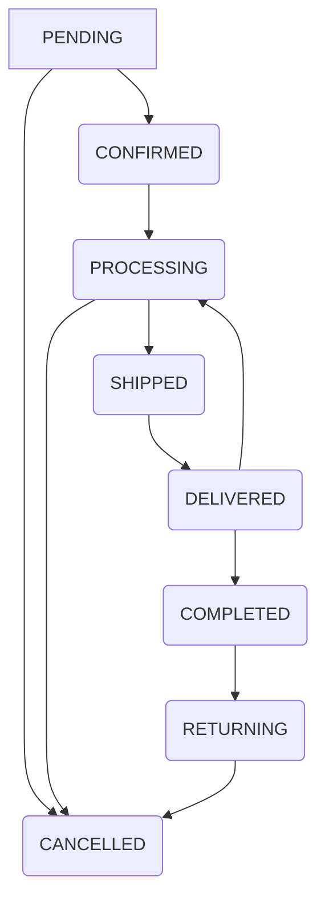

# Business Logic & Rules - MeoCRM

> **Mục đích:** Tài liệu này định nghĩa tất cả các quy tắc nghiệp vụ (business rules) của hệ thống MeoCRM.
> **Audience:** Đội ngũ phát triển (Jules, Codex, Gemini), quản lý sản phẩm, và các bên liên quan.
> **Status:** Phiên bản chính thức, đã được kiểm toán và thống nhất.

---

## 1️⃣ Order Processing Rules

### 1.1 Quy trình trạng thái đơn hàng

**Workflow trạng thái đơn hàng:**

*   **PENDING (Đang xử lý):** Trạng thái khởi tạo của đơn hàng.
*   **CONFIRMED (Đã xác nhận):** Đơn hàng đã được xác nhận.
*   **PROCESSING (Đang thực hiện):** Đơn hàng đang được chuẩn bị/xử lý.
*   **SHIPPED (Đang vận chuyển):** Đơn hàng đã được bàn giao cho đối tác vận chuyển.
*   **DELIVERED (Đã giao hàng):** Đơn hàng đã được giao thành công cho khách hàng.
*   **COMPLETED (Hoàn thành):** Đơn hàng đã hoàn tất, tiền đã được thu.
*   **CANCELLED (Đã hủy):** Đơn hàng bị hủy.
*   **RETURNING (Đang hoàn hàng):** Đơn hàng đang trong quá trình được trả về kho.

### PENDING (Đang xử lý)

- **Quy tắc tạo:** Khi tạo đơn hàng mới không phải là đơn POS đã thanh toán.
- **Quy tắc kiểm tra kho (Decision #26):**
    - Kiểm tra stock trước khi tạo đơn hàng.
    - Hiển thị cảnh báo nếu `stock < requested quantity` (nhưng > 0), nhưng VẪN CHO PHÉP tạo đơn hàng.
    - **BLOCK** việc tạo đơn hàng nếu `stock <= 0` (hết hàng).
- **Quy tắc khác:**
    - KHÔNG yêu cầu khách hàng xác nhận qua email/SMS. Admin tạo đơn → Đơn hàng PENDING luôn (phù hợp POS).
    - **KHÔNG trừ stock** ngay tại thời điểm PENDING.
    - KHÔNG tự động tạo vận đơn khi PENDING.

### PROCESSING (Đang thực hiện)

- **Quy tắc chuyển trạng thái:** Thường được kích hoạt khi Admin tạo một vận đơn cho đơn hàng.
- **Actions tự động (Decision #1):**
    - **Trừ stock:** Tự động trừ tồn kho khi đơn hàng chuyển sang trạng thái `PROCESSING`. Thao tác này phải được thực hiện trong một giao dịch database đồng nhất.
    - Gửi notification cho khách hàng: Code phải phát ra sự kiện `orders.status.changed`, việc gửi thông báo thực tế sẽ được triển khai sau.

### COMPLETED (Hoàn thành)

- **Workflow 1: Đơn bán tại cửa hàng (POS)**
    - PENDING → **COMPLETED ngay lập tức** nếu là đơn POS và đã thanh toán.
    - `totalSpent` và `totalOrders` của khách hàng được cập nhật ngay lập tức.
- **Workflow 2: Đơn COD ship đi (Decision #37):**
    - `PROCESSING` → `SHIPPED` → `DELIVERED` → `COMPLETED`.
    - Khi đơn hàng COD được báo `DELIVERED` (thông qua webhook hoặc admin), hệ thống phải tự động chuyển trạng thái đơn hàng thành `COMPLETED`, đánh dấu `isPaid = true`, và cập nhật `totalSpent`, `totalOrders`, `debt` của khách hàng.

### CANCELLED (Đã hủy)

- **Quy tắc cho phép hủy:**
    - Cho phép chuyển từ `PENDING` → `CANCELLED`.
    - Cho phép chuyển từ `PROCESSING` → `CANCELLED`.
    - KHÔNG được phép chuyển từ `COMPLETED` → `CANCELLED` (phải thông qua quy trình refund).
- **Actions tự động (Decision #1):**
    - Cập nhật công nợ của khách hàng: Trừ lại công nợ đã tăng.
    - **Hoàn stock:** Tự động hoàn trả tồn kho về cho chi nhánh tương ứng nếu đơn hàng bị hủy từ trạng thái `PROCESSING`. Thao tác này phải là một phần của giao dịch đồng nhất.

### RETURNING (Đang hoàn hàng)

- **Quy tắc chuyển trạng thái:** Khi một đơn hàng đang vận chuyển bị báo `RETURNED` bởi đối tác vận chuyển.
- **Actions tự động:**
    - Cập nhật trạng thái đơn hàng thành `RETURNING`.
    - **KHÔNG thay đổi tồn kho** ở bước này.
- **Quy tắc kết thúc:** Cần có một hành động xác nhận thủ công từ admin ("Đã nhận hàng hoàn") để chuyển đơn hàng từ `RETURNING` sang `CANCELLED`. Việc này sẽ kích hoạt logic hoàn stock.

### 1.2 Refund Policy

- **Quy tắc:** Các quy tắc về hoàn tiền (`settings.refund`) và luồng `RefundRequest` phải được đọc từ Settings. API cho việc này (`/orders/:orderId/refund-request`) có tồn tại nhưng logic nghiệp vụ bên trong cần được kiểm tra.

---

## 2️⃣ Payment & Debt Rules

### 2.1 Customer Debt Calculation (Decision #30)

- **Quy tắc:** Công nợ của khách hàng được cộng dồn khi tạo đơn hàng chưa thanh toán và trừ khi hủy đơn hàng hoặc khi đơn COD được thanh toán.
- **Đặc điểm:** Công nợ khách hàng CÓ THỂ ÂM (overpayment) nếu khách hàng trả nhiều hơn số nợ.
- **Hỗ trợ:** Model `CustomerDebtSnapshot` tồn tại để hỗ trợ tính năng snapshot hàng đêm.

### 2.2 Partial Payment Rules

- **Quy tắc:** Hệ thống **KHÔNG hỗ trợ thanh toán một phần (partial payment)**. Nếu `isPaid=false` nhưng `paidAmount>0` sẽ báo lỗi.

### 2.3 Payment Method Validation

- **Quy tắc:**
    - Khi tạo đơn hàng mới: Nếu `paymentMethod` là `COD` và `isPaid` là `true`, hệ thống sẽ báo lỗi `BadRequestException` vì đơn COD không thể được đánh dấu là đã trả tiền trước.

### 2.4 Cash Rounding Rules

- **Quy tắc:** Hệ thống **KHÔNG làm tròn tiền mặt**. Code sử dụng kiểu dữ liệu `Decimal` để đảm bảo tính chính xác.

---

## 3️⃣ Inventory & Stock Rules

### 3.1 Stock Deduction & Return for Orders (Decision #1, Decision #11)

- **Trừ stock:** Khi đơn hàng chuyển sang `PROCESSING`, tồn kho phải được trừ khỏi chi nhánh tương ứng. Thao tác này phải là một phần của giao dịch đồng nhất và phải báo lỗi nếu tồn kho không đủ (không cho phép tồn kho âm).
- **Hoàn stock:** Khi đơn hàng bị hủy từ trạng thái `PROCESSING`, tồn kho phải được hoàn trả về cho chi nhánh.

### 3.3 Low Stock Warnings

- **Quy tắc:**
    - Cảnh báo được tạo ra khi `stock < minStock` (hoặc `stock < requested quantity` nhưng > 0).
    - Block tạo đơn hàng khi `stock = 0`.
    - Ngăn chặn stock âm từ các điều chỉnh thủ công.

### 3.4 Inter-branch Transfer Rules (Decision #31-33)

- **Quy tắc:** Quy trình chuyển kho là đa giai đoạn:
    - **PENDING:** Phiếu chuyển được tạo, chưa thay đổi tồn kho.
    - **IN_TRANSIT:** Khi hàng được gửi đi từ kho nguồn, tồn kho bị trừ ở kho đi.
    - **RECEIVED:** Khi hàng đến kho đích, tồn kho được cộng vào kho đến.
    - **CANCELLED:** Có thể hủy từ `PENDING` hoặc `IN_TRANSIT`. Nếu hủy từ `IN_TRANSIT`, tồn kho đã trừ ở kho đi phải được hoàn trả.

---

## 4️⃣ Pricing & Discount Rules

### 4.1 Product Pricing

- **Quy tắc:**
    - Cho phép bán lỗ (`sellPrice < costPrice`).
    - Cần triển khai cảnh báo khi bán lỗ ở tầng service.

### 4.2 Variant Pricing

- **Quy tắc:** Cho phép `additionalPrice` (giá cộng thêm cho biến thể) có thể âm, nhưng giá cuối cùng của sản phẩm (giá bán + `additionalPrice`) phải luôn lớn hơn 0.

### 4.3 Discount Rules (Decision #18)

- **Quy tắc:**
    - Hỗ trợ giảm giá cấp độ đơn hàng.
    - **Giảm giá cấp độ mặt hàng (item-level discount)** phải được triển khai thông qua trường `discountAmount` trên từng `OrderItem`. Logic tính toán phải tính tổng phụ sau khi áp dụng chiết khấu từng mặt hàng.

### 4.4 Tax Calculation (Decision #XX - cần định nghĩa rõ hơn)

- **Quy tắc:** VAT phải được tính trên `(subtotal - totalItemDiscounts - totalOrderDiscount)` (giá trị sau khi đã áp dụng tất cả chiết khấu).
- Logic cho `isVatExempt` (miễn VAT) cần được triển khai và tính vào `taxableSubtotal`.

---

## 5️⃣ Shipping & Logistics Rules

### 5.1 Shipping Fee Calculation (Decision #5)

- **Quy tắc:** Service tính phí vận chuyển phải **ưu tiên gọi API** của đối tác vận chuyển (ví dụ: GHN, GHTK) để lấy giá cước thời gian thực. Nếu API gặp lỗi hoặc không khả dụng, hệ thống phải **dự phòng bằng cách sử dụng bảng giá cố định** được cấu hình trong settings.

### 5.2 COD Collection Rules (Decision #37)

- **Quy tắc:** Khi một vận đơn COD được báo `DELIVERED` (thành công) bởi đối tác vận chuyển (qua webhook hoặc admin), hệ thống phải tự động:
    - Cập nhật trạng thái đơn hàng (Order) gốc thành `COMPLETED` và `isPaid = true`.
    - Cập nhật các chỉ số của khách hàng (`totalSpent`, `totalOrders`, `debt`).

### 5.3 Failed/Returned Delivery (Decision #23)

- **Quy tắc:**
    - **Giao hàng thất bại (`FAILED`):** Khi đối tác vận chuyển báo `FAILED`, trạng thái đơn hàng (Order) phải được chuyển về `PENDING` để admin xử lý lại (ví dụ: gửi lại). KHÔNG thay đổi tồn kho.
    - **Đơn hàng bị hoàn trả (`RETURNED`):**
        - **Giai đoạn 1 (Bắt đầu hoàn):** Khi đối tác vận chuyển báo `RETURNED`, trạng thái đơn hàng (Order) phải được chuyển thành `RETURNING` (Đang hoàn hàng). KHÔNG thay đổi tồn kho ở bước này.
        - **Giai đoạn 2 (Nhận hàng hoàn):** Admin phải có hành động xác nhận đã nhận hàng hoàn. Hành động này sẽ chuyển trạng thái Order thành `CANCELLED`, kích hoạt logic hoàn trả tồn kho.

---

## 6️⃣ Customer Management Rules

- **Phân khúc khách hàng:** Logic phân khúc khách hàng phải linh hoạt và có thể cấu hình.
- **Cập nhật chỉ số:** Logic cập nhật và hoàn tác `totalSpent` / `totalOrders` phải nhất quán.
- **Ngăn chặn trùng lặp:** Ngăn chặn khách hàng trùng lặp qua số điện thoại.
- **Phân khúc mặc định:** Danh sách các `Default segments` trong tài liệu cần được đồng bộ với seed script.

---

## 7️⃣ Multi-tenant Security Rules

### 7.1 Organization Isolation (Decision #1)

- **Quy tắc:** Mọi truy vấn database phải được bảo vệ bởi một Prisma middleware, middleware này tự động chèn điều kiện `where: { organizationId: '...' }` vào tất cả các lệnh `find`, `update`, `delete`, v.v., cho các model có `organizationId`. Cần có cơ chế để bỏ qua middleware này cho các query ở cấp độ hệ thống.
- **Quan trọng:** Việc cách ly tenant KHÔNG được thực hiện thủ công trong từng câu query để tránh rủi ro bảo mật.
- **Trạng thái (11/2025):** PrismaService đã có middleware `organizationScope` đọc `RequestContextService`, mọi truy vấn tự động được ghép `organizationId`. Khi cần truy vấn đa tenant (ví dụ: `SettingsService.getForOrganization`) sử dụng decorator `@OrganizationScopedModel` để bỏ qua an toàn.

---

## 8️⃣ Audit & Logging Rules

### 8.1 Audit Trail Requirements (Decision #XX - cần định nghĩa rõ hơn)

- **Quy tắc:** `AuditLogService` phải được gọi để ghi lại các hành động tạo, sửa, xóa quan trọng trong các service nghiệp vụ như `OrdersService`, `ProductsService`, `InventoryService`, v.v. Bản ghi log phải chứa `userId`, `actionType`, `entityId`, và `payload` (dữ liệu cũ và mới nếu có).
- **Trạng thái (11/2025):** Orders (create/status/COD), Inventory (adjust/reserve/transfer/return) và Shipping (create/status) đã ghi log với prefix `order.*/inventory.*`. TraceId lấy từ `RequestContextService`, Cron `AuditLogArchiveService` tự động dọn log > `AUDIT_LOG_RETENTION_DAYS` (mặc định 90 ngày).

### 8.2 Data Retention Policy

- **Quy tắc:**
    - **Xóa mềm:** Tất cả các bản ghi có `deletedAt` phải hỗ trợ xóa mềm.
    - **Khôi phục dữ liệu (Restore):** Cần triển khai tính năng khôi phục dữ liệu đã xóa mềm.
    - **Xóa vĩnh viễn tự động (Auto-Hard Delete):** Cần triển khai cron job để xóa vĩnh viễn các bản ghi đã xóa mềm sau một khoảng thời gian nhất định (ví dụ: 6 tháng).
- **Trạng thái:** Cron `AuditLogArchiveService` đang chạy hàng ngày lúc 01:00 theo `CronExpression.EVERY_DAY_AT_1AM`, phần purge soft delete vẫn TODO.

---

## 9️⃣ Reports & Analytics Rules

- **Nội dung cần được cung cấp:** Định nghĩa các quy tắc nghiệp vụ liên quan đến việc tạo và tổng hợp các báo cáo bán hàng, tồn kho, khách hàng, v.v. (Ví dụ: cách tính KPI, tần suất cập nhật dữ liệu báo cáo, quyền truy cập báo cáo).

---

## 🔟 Integrations Rules

- **Nội dung cần được cung cấp:** Định nghĩa các quy tắc và luồng nghiệp vụ liên quan đến việc tích hợp với các hệ thống bên ngoài (ví dụ: quy tắc đồng bộ dữ liệu với đối tác vận chuyển, quy tắc xử lý webhook, các quy tắc cho MCP tools).

---

## 1️⃣1️⃣ Settings-driven Configuration Rules

- **Nội dung cần được cung cấp:** Định nghĩa các quy tắc nghiệp vụ liên quan đến việc sử dụng hệ thống cấu hình `SettingsService` cho mọi hành vi có thể cấu hình (ví dụ: quy tắc ưu tiên các cấp độ cấu hình, quy tắc invalidation cache settings, các key setting quan trọng và giá trị mặc định của chúng).

---
